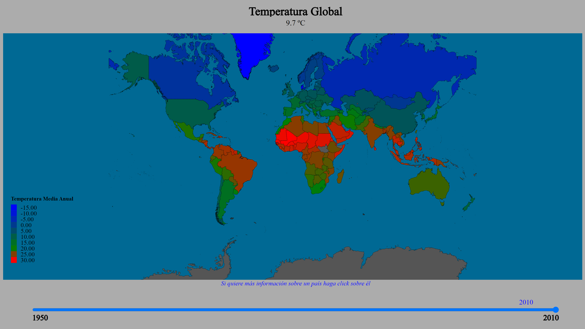
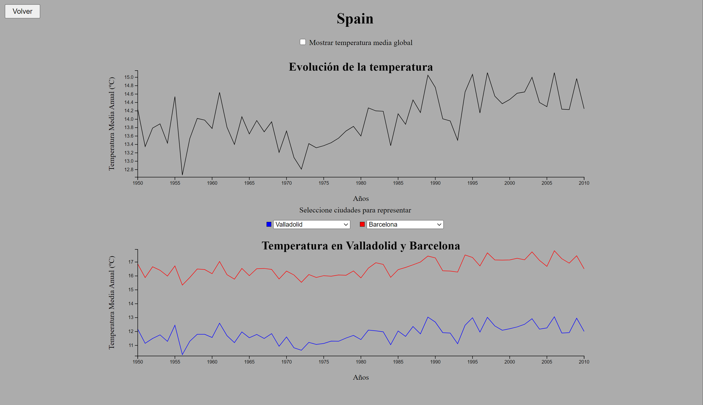

# Proyecto de visualización de las temperaturas globales
Disponible en: https://javigames184.github.io/uva.desi/

## Diseño
Se emplea un mapa coroplético con la temperatura media en cada uno de los paises como variable para seleccionar el color (color azul para temperaturas bajas, rojo para las temperaturas altas, verde para las medias y combinaciones de ellos para las intermedias) con una barra deslizadora para que el usuario elija el año en el que está interesado.

Si en el mapa se pulsa sobre cualquiera de los países se mostrará, en otra ventana, dos gráficos de líneas animados, uno simple con la temperatura media del país y la opción de añadir en este la temperatura media global y otro múltiple con la de las ciudades más relevantes que se hayan seleccionado (sería simple si únicamente se selecciona una ciudad).

## Análisis de los datos
Utilizamos los datos de https://www.kaggle.com/datasets/berkeleyearth/climate-change-earth-surface-temperature-data que son los que contienen la información relacionada con la temperatura en todo el mundo a lo largo de los años.

Disponemos de los siguientes archivos donde tenemos las siguientes variables (solamente se indican las que se pretende utilizar):
GlobalTemperatures.csv: Archivo con las temperaturas mensuales medias globales.
- dt: Variable cuantitativa de intervalo. Fecha en el que se registra la temperatura, el primer día de todos los meses desde el 1750 al 2013.
- LandAverageTemperature: Variable numérica continua. Contiene las temperaturas globales en grados Celsius.

GlobalLandTemperaturesByCountry.csv: Archivo con la temperatura mensual media en diferentes países.
- dt: Variable cuantitativa de intervalo. Fecha en el que se registra la temperatura, el primer día de todos los meses desde el año 1750 al 2013.
- Country: Variable categórica nominal. País en el que se registra la temperatura.
- AverageTemperature: Variable numérica continua. Contiene la temperatura media en grados Celsius de cada mes para cada país.
  
GlobalLandTemperaturesByCity.csv: Archivo con la temperatura mensual media en diferentes ciudades.
- dt: Variable cuantitativa de intervalo. Fecha en el que se registra la temperatura, el primer día de todos los meses desde el año 1750 al 2013.
- City: Variable categórica nominal. Ciudad en la que se registra la temperatura.
- Country: Variable categórica nominal. País en el que se registra la temperatura.
- AverageTemperature: Variable numérica continua. Contiene la temperatura media en grados Celsius de cada mes para cada una de las ciudades.

GlobalLandTemperaturesByMajorCity.csv: Archivo con la temperatura mensual media en algunas de las ciudades más grandes de cada país.
- dt: Variable cuantitativa de intervalo. Fecha en el que se registra la temperatura, el primer día de todos los meses desde el año 1750 al 2013.
- City: Variable categórica nominal. Ciudad en la que se registra la temperatura.
- Country: Variable categórica nominal. País en el que se registra la temperatura.
- AverageTemperature: Variable numérica continua. Contiene la temperatura media en grados Celsius de cada mes para cada una de las ciudades.
  
Disponemos de información de la temperatura desde el año 1750 hasta el 2013 de un número muy extenso de ciudades y países. Además, en todos los archivos faltan datos de las temperaturas para algunas ubicaciones en fechas previas al 1900. Por estos motivos pensamos modificar los diferentes archivos para reducir el rango de años y número de lugares con el objetivo principal de hacer los datos más manejables y evitar errores por no contar con todos los datos. Por otra parte, será necesario hacer un preprocesamiento de los archivos para conseguir los valores de la temperatura media en los diferentes países para cada año ya que únicamente se tienen estos valores para cada mes.

## Referencias
[1]Ortega Arranz, A. Vivaracho, C. (2023). Tema 1. Principios básicos de la Visualización de Datos. Diseño y Evaluación de Sistemas Interactivos. Universidad de Valladolid.

[2] Ortega Arranz, A. Vivaracho, C. (2023). Tema 2. Los datos. Universidad de Valladolid.

[3] Ortega Arranz, A. Vivaracho, C. (2023). Tema 5. Percepción y cognición. Universidad de Valladolid.

[4]https://www.kaggle.com/datasets/berkeleyearth/climate-change-earth-surface-temperature-data (Consultada: 16-11-23)
